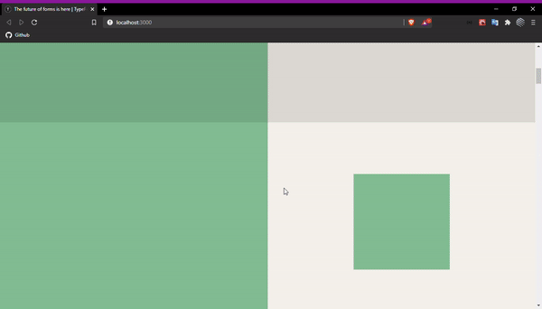

<div align="center">
  
</div>

# TypeForm Clone
A clone of Typeform animation using Framer Motion and React.<br/>


## Technologies
* React
* Typescript
* styled-components
* Framer Motion

## How to run

```
# Clone repository

git clone https://github.com/r3nanp/typeform-clone.git
```

```
# At the root of the project, run:

yarn
```

```
# Run app

yarn start or npm start
```

<!-- ### Link
[Website]() -->

